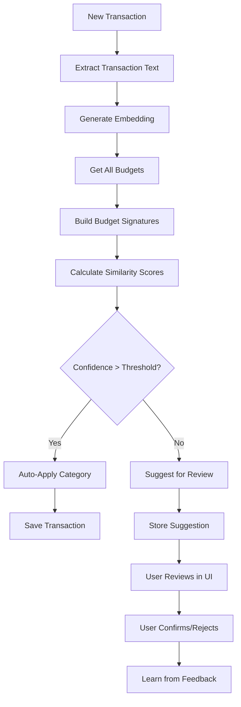

# AI Budget Auto-Categorization with NLP

## Overview

Implement an AI-powered categorization system that uses local machine learning (sentence-transformers) to automatically match transactions to existing budgets based on semantic similarity. This will work for both standard Plaid categories and custom user-defined categories, learning from historical transaction patterns.

## Current State

- Transactions are categorized using Plaid's `personal_finance_category` (primary/detailed)
- If category doesn't exist, defaults to `OTHER/OTHER` via `resolve_category_and_subcategory()` in [`backend/utils/txn_utils.py`](backend/utils/txn_utils.py)
- Budgets are linked to categories/subcategories, not directly to transactions
- Budget spending is calculated by matching transactions with same `category_id`/`subcategory_id` in [`backend/models/budget/budget_utils.py`](backend/models/budget/budget_utils.py)
- Transaction sync happens in `handle_added_transactions()` in [`backend/routes/item_routes.py`](backend/routes/item_routes.py)

## Architecture

## Implementation Plan

### 1. Install Dependencies

- Add `sentence-transformers` to [`backend/requirements.txt`](backend/requirements.txt)
- Add `torch` (required by sentence-transformers, may already be needed)
- Use lightweight model: `all-MiniLM-L6-v2` (~80MB, fast inference)

### 2. Create AI Categorization Service

**New file: [`backend/utils/budget_categorizer.py`](backend/utils/budget_categorizer.py)**

- **`BudgetCategorizer` class**:
  - Initialize sentence-transformer model on first use (lazy loading)
  - Cache model and embeddings for performance
  - **`build_budget_signature(budget)`**: Create text signature from:
    - Category name + subcategory name
    - **Historical transaction patterns**: Query all transactions already categorized to this budget's category/subcategory
      - Include transaction names (top 20-50 most recent for better pattern recognition)
      - Include merchant names if available
      - Weight recent transactions more heavily
    - This creates a "fingerprint" of what transactions belong to this budget
  - **`categorize_transaction(transaction_text, budgets)`**:
    - Generate embedding for transaction (name + merchant)
    - Compare against all budget signatures using cosine similarity
    - Return top matches with confidence scores
  - **`get_confidence_threshold()`**: Configurable threshold (default 0.7) for auto-apply
  - **Learning mechanism**: Budget signatures are rebuilt periodically (or on-demand) to include newly categorized transactions, making future categorizations more accurate

### 3. Integrate into Transaction Sync Flow

**Modify: [`backend/routes/item_routes.py`](backend/routes/item_routes.py)**

- In `handle_added_transactions()`:

  1. First try Plaid categorization (existing logic)
  2. If category is `OTHER/OTHER` or user wants AI override:

     - Call AI categorizer with transaction details
     - If confidence > threshold: auto-apply best match
     - If confidence < threshold: store suggestion for review

  3. Add flag to transaction model or separate table to track AI-suggested categories

### 4. Create API Endpoints

**Modify: [`backend/routes/budget_routes.py`](backend/routes/budget_routes.py)** or create new route file

- **`POST /api/budget/categorize`**:

  - Accept transaction details (name, merchant, amount)
  - Return top 3 budget matches with confidence scores
  - Used for manual categorization UI

- **`GET /api/budget/<budget_id>/signature`**:

  - Return budget signature details (for debugging/admin)

- **`POST /api/transaction/<txn_id>/categorize`**:
  - Re-categorize existing transaction using AI
  - Update transaction category/subcategory

### 5. Store Categorization Suggestions

**Option A**: Add fields to Transaction model

- `ai_suggested_category_id` (nullable)
- `ai_suggested_subcategory_id` (nullable)
- `ai_confidence_score` (nullable float)

**Option B**: Create separate `CategorizationSuggestion` model

- Links to transaction
- Stores suggested category/subcategory
- Confidence score
- Status (pending/approved/rejected)

**Recommendation**: Option A (simpler, less overhead)

### 6. Learning from Historical Categorizations

**Automatic Learning (Primary Method)**:

- Budget signatures are built from **all transactions already categorized** to that budget's category/subcategory
- When a transaction is categorized (manually or via AI), it becomes part of the historical dataset
- Budget signatures are refreshed:
  - On-demand when categorizing (always use latest data)
  - Periodically (e.g., daily) to update cached signatures
  - When budgets are modified
- **Example**: If you've categorized 50 "Starbucks" transactions to "Food & Dining" budget, future "Starbucks" transactions will have high similarity to that budget

**Explicit Learning from User Feedback**:

- Track when users accept/reject AI suggestions
- When user manually changes a transaction category, that becomes a new example for that budget
- Optionally track corrections to identify patterns (e.g., "user always moves X to Y")
- Store feedback in simple log or database table for analytics
- **Continuous improvement**: As more transactions are categorized, the system gets better at recognizing patterns specific to your spending habits

### 7. Frontend Integration

**Modify: [`frontend/src/Components/TransactionTable/TransactionTable.tsx`](frontend/src/Components/TransactionTable/TransactionTable.tsx)**

- Show AI suggestion badge/icon for transactions with AI suggestions
- Display confidence score as tooltip
- Add "Apply AI Suggestion" button/action
- Highlight transactions that were auto-categorized by AI

**New component: [`frontend/src/Components/AICategorization/AISuggestionBadge.tsx`](frontend/src/Components/AICategorization/AISuggestionBadge.tsx)**

- Visual indicator for AI-suggested categories
- Click to view/apply suggestion

**Optional: Bulk Review Page**

- List all transactions with pending AI suggestions
- Allow bulk accept/reject
- Show confidence scores and alternatives

### 8. Configuration

**Add to environment/config:**

- `AI_CATEGORIZATION_ENABLED` (default: true)
- `AI_CONFIDENCE_THRESHOLD` (default: 0.7)
- `AI_AUTO_APPLY` (default: true)
- `AI_MODEL_NAME` (default: "all-MiniLM-L6-v2")

## Files to Create/Modify

### Backend

1. **`backend/utils/budget_categorizer.py`** (NEW)

   - `BudgetCategorizer` class with embedding generation and similarity matching

2. **`backend/routes/item_routes.py`**

   - Integrate AI categorization into `handle_added_transactions()`

3. **`backend/routes/budget_routes.py`**

   - Add categorization endpoints

4. **`backend/models/transaction/txn.py`**

   - Add optional fields: `ai_suggested_category_id`, `ai_suggested_subcategory_id`, `ai_confidence_score`

5. **`backend/requirements.txt`**

   - Add `sentence-transformers>=2.2.0`

6. **`backend/utils/txn_utils.py`**

   - Add helper function `apply_ai_categorization(transaction, budgets)`

### Frontend

1. **`frontend/src/Components/TransactionTable/TransactionTable.tsx`**

   - Display AI suggestions and allow applying them

2. **`frontend/src/Components/AICategorization/AISuggestionBadge.tsx`** (NEW)

   - Visual component for AI suggestions

3. **`frontend/src/hooks/apiService.ts`**

   - Add API methods for categorization endpoints

4. **`frontend/src/Models/Transaction.ts`**

   - Add optional fields for AI suggestions

## Database Migration

- Add nullable columns to `txn` table:
  - `ai_suggested_category_id` VARCHAR(120)
  - `ai_suggested_subcategory_id` VARCHAR(120)
  - `ai_confidence_score` NUMERIC(3, 2)

## Performance Considerations

- Lazy load ML model (only initialize when first needed)
- Cache budget signatures (recompute when budgets change)
- Batch process multiple transactions to reuse embeddings
- Consider async processing for large transaction syncs
- Model loading takes ~1-2 seconds on first use, then fast

## Testing Strategy

1. **Unit tests**: Test `BudgetCategorizer` with mock transactions and budgets
2. **Integration tests**: Test categorization during transaction sync
3. **Edge cases**:

   - No budgets exist
   - All budgets have same category
   - Very similar transaction names
   - Empty/null transaction names

## Future Enhancements

- Allow users to provide examples/exceptions for budgets
- Fine-tune model on user's historical data
- Support for multi-language transaction names
- Category merging suggestions
- Budget creation suggestions based on transaction patterns
