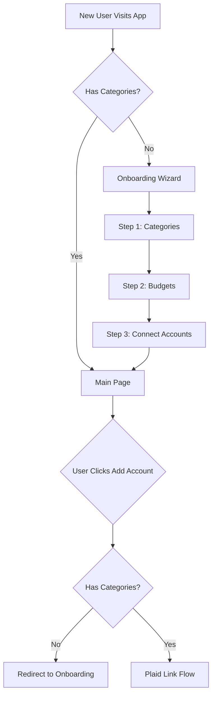

# Improve Category Management and Onboarding Flow

## Overview

Implement a comprehensive onboarding experience that forces users to set up categories before adding accounts, and completely revamp the category management page with modern UI, drag-and-drop, bulk actions, search/filter capabilities, and category templates.

## Progress Summary

### ✅ Completed (Steps 1-2)

- **Onboarding Utilities**: Created `onboardingUtils.ts` with all validation functions and comprehensive unit tests (15 tests, all passing)
- **Onboarding Wizard**: Created complete multi-step wizard with 3 steps (categories, budgets, accounts)
- **Routing & Integration**: Added onboarding route, redirect logic in Main page, and category checks in Link component
- **Files Created**:
  - `OnboardingWizard.tsx`, `OnboardingStepCategories.tsx`, `OnboardingStepBudgets.tsx`, `OnboardingStepAccounts.tsx`
  - `onboardingUtils.ts` with tests
- **Files Modified**: `App.tsx`, `Main.tsx`, `Link/index.tsx`, `RouteConstants.ts`

### 🚧 In Progress

- None currently

### ⏳ Pending

- Backend changes for `display_order` fields
- Drag-and-drop reordering
- Search and filter functionality
- Bulk actions (selection, delete, import, export)
- Category templates system
- Modern UI redesign

## Current State

- Users can add accounts immediately without setting up categories
- Category Management page (`/manage-categories`) has basic card-based UI
- Categories are displayed in simple cards with collapsible subcategories
- No onboarding flow - users land directly on Main page
- No way to reorder categories/subcategories
- No bulk operations
- No search or filter functionality
- No category templates or presets

## Architecture

## Implementation Plan

### 1. Create Onboarding Wizard ✅ COMPLETED

**New component: [`frontend/src/Components/Onboarding/OnboardingWizard.tsx`](frontend/src/Components/Onboarding/OnboardingWizard.tsx)** ✅

- Multi-step wizard using MUI Stepper ✅
- **Step 1: Set Up Categories** ✅
  - Embedded category management UI (simplified version) ✅
  - Require at least 3 categories before proceeding ✅
  - Progress indicator showing completion ✅
- **Step 2: Create Budgets** (optional but recommended) ✅
  - Link to budget creation ✅
  - Can skip with "I'll do this later" button ✅
  - Show helpful tips about budgets ✅
- **Step 3: Connect Your First Account** ✅
  - Plaid Link integration ✅
  - Success message and redirect to Main page ✅

**New route: [`frontend/src/Constants/RouteConstants.ts`](frontend/src/Constants/RouteConstants.ts)** ✅

- Add `ONBOARDING_ROUTE = "/onboarding"` ✅

**Modify: [`frontend/src/App.tsx`](frontend/src/App.tsx)** ✅

- Add onboarding route ✅

**New utility: [`frontend/src/Utils/onboardingUtils.ts`](frontend/src/Utils/onboardingUtils.ts)** ✅

- `checkOnboardingStatus()`: Check if user has completed onboarding ✅
- `markOnboardingComplete()`: Store completion in localStorage ✅
- `shouldShowOnboarding()`: Determine if user needs onboarding ✅
- `hasSufficientCategories()`: Check if user has at least 3 categories ✅
- `hasCategories()`: Check if user has any categories ✅
- All functions have comprehensive unit tests (15 tests, all passing) ✅

### 2. Add Onboarding Check to Main Page ✅ COMPLETED

**Modify: [`frontend/src/Pages/Main.tsx`](frontend/src/Pages/Main.tsx)** ✅

- On mount, check if user has categories ✅
- If no categories exist, redirect to onboarding ✅
- Category check implemented with `shouldShowOnboarding()` ✅

**Modify: [`frontend/src/Components/Link/index.tsx`](frontend/src/Components/Link/index.tsx)** ✅

- Check for categories before allowing Plaid Link to open ✅
- Show informative message if categories don't exist ✅
- Button disabled with tooltip when categories are missing ✅

### 3. Redesign Category Management Page

**Modify: [`frontend/src/Pages/CategoryManagement.tsx`](frontend/src/Pages/CategoryManagement.tsx)**

#### Modern Card-Based Design

- Use MUI Card with elevation and better spacing
- Add icons for each category type
- Color coding for visual distinction
- Better typography hierarchy
- Smooth animations for expand/collapse
- Responsive grid layout

#### Drag-and-Drop Reordering

- Install `@dnd-kit/core` and `@dnd-kit/sortable`
- Allow dragging categories to reorder
- Allow dragging subcategories within categories
- Visual feedback during drag (ghost image, drop zones)
- Save order to backend (add `display_order` field to models)
- Persist order in database

#### Search and Filter

- Add search bar at top of page
- Filter by category name
- Filter by subcategory name
- Highlight search matches
- Clear search button
- Show "No results" state

#### Bulk Actions

- Checkbox selection for categories/subcategories
- Bulk delete selected items
- Bulk export to JSON/CSV
- Bulk import from JSON/CSV
- Select all / Deselect all
- Show count of selected items

#### Category Templates

- Pre-built category sets:
  - **Personal Finance**: Food, Transportation, Entertainment, Bills, etc.
  - **Business**: Office Supplies, Travel, Marketing, etc.
  - **Minimalist**: Essentials only
  - **Custom**: User-defined template
- Template preview before applying
- "Apply Template" button that adds all categories/subcategories
- Option to merge with existing categories or replace
- Save custom templates for reuse

### 4. Backend Changes for Ordering

**Modify: [`backend/models/transaction/txn_category.py`](backend/models/transaction/txn_category.py)**

- Add `display_order` field (Integer, nullable, default=None)

**Modify: [`backend/models/transaction/txn_subcategory.py`](backend/models/transaction/txn_subcategory.py)**

- Add `display_order` field (Integer, nullable, default=None)

**Modify: [`backend/routes/txn_category_routes.py`](backend/routes/txn_category_routes.py)**

- Add `PUT /api/category/reorder` endpoint
- Accept array of category IDs in desired order
- Update display_order for all categories

**Modify: [`backend/routes/txn_subcategory_routes.py`](backend/routes/txn_subcategory_routes.py)**

- Add `PUT /api/subcategory/reorder` endpoint
- Accept array of subcategory IDs in desired order

**Database Migration**

- Add `display_order` columns to `txn_category` and `txn_subcategory` tables
- Set initial order based on creation date or alphabetical

### 5. Backend Endpoints for Templates

**New file: [`backend/routes/category_template_routes.py`](backend/routes/category_template_routes.py)**

- `GET /api/category/templates`: List available templates
- `POST /api/category/templates/apply`: Apply a template
  - Accept template ID and merge/replace option
  - Create all categories/subcategories from template
- `POST /api/category/templates/save`: Save current categories as custom template
- `GET /api/category/templates/custom`: Get user's custom templates

**Template Data Structure**

- Store templates as JSON files or in database
- Include category names, subcategory names, and descriptions
- Metadata: name, description, category count

### 6. Import/Export Functionality

**Backend: [`backend/routes/txn_category_routes.py`](backend/routes/txn_category_routes.py)**

- `GET /api/category/export`: Export all categories as JSON
- `POST /api/category/import`: Import categories from JSON
  - Validate structure
  - Handle duplicates (skip, merge, or replace)
  - Return import summary

**Frontend: [`frontend/src/Pages/CategoryManagement.tsx`](frontend/src/Pages/CategoryManagement.tsx)**

- "Export" button in toolbar
- "Import" button with file picker
- Show import preview before applying
- Display import results (success/errors)

### 7. Enhanced Category Card Component

**Modify: [`frontend/src/Components/CategoryManagement/CategoryCard.tsx`](frontend/src/Components/CategoryManagement/CategoryCard.tsx)**

- Add drag handle icon
- Add checkbox for bulk selection
- Better visual design with icons
- Show category usage stats (transaction count)
- Quick actions menu (edit, duplicate, delete)
- Color picker for category color coding

### 8. Onboarding State Management

**Modify: [`frontend/src/Context/index.tsx`](frontend/src/Context/index.tsx)**

- Add `onboardingComplete` to state
- Add action to mark onboarding complete
- Persist to localStorage

**Alternative: Backend Storage**

- Add `user_settings` table or field
- Store onboarding status per user
- Useful for multi-user scenarios

## Files to Create/Modify

### Frontend

1. **`frontend/src/Components/Onboarding/OnboardingWizard.tsx`** (NEW) ✅

   - Multi-step wizard component ✅

2. **`frontend/src/Components/Onboarding/OnboardingStepCategories.tsx`** (NEW) ✅

   - Category setup step ✅
   - Note: Templates feature to be added in future step

3. **`frontend/src/Components/Onboarding/OnboardingStepBudgets.tsx`** (NEW) ✅

   - Budget setup step (optional) ✅

4. **`frontend/src/Components/Onboarding/OnboardingStepAccounts.tsx`** (NEW) ✅

   - Account connection step ✅

5. **`frontend/src/Pages/CategoryManagement.tsx`**

   - Complete redesign with all new features

6. **`frontend/src/Components/CategoryManagement/CategoryCard.tsx`**

   - Enhanced with drag-and-drop, selection, modern design

7. **`frontend/src/Components/CategoryManagement/CategoryTemplateSelector.tsx`** (NEW)

   - Template selection and preview component

8. **`frontend/src/Components/CategoryManagement/CategorySearchBar.tsx`** (NEW)

   - Search and filter component

9. **`frontend/src/Components/CategoryManagement/BulkActionsBar.tsx`** (NEW)

   - Bulk actions toolbar

10. **`frontend/src/Utils/onboardingUtils.ts`** (NEW) ✅

    - Onboarding utility functions ✅
    - Comprehensive unit tests (15 tests, all passing) ✅

11. **`frontend/src/Pages/Main.tsx`** ✅

    - Add onboarding check and redirect logic ✅

12. **`frontend/src/Components/Link/index.tsx`** ✅

    - Add category check before allowing account addition ✅

13. **`frontend/src/App.tsx`** ✅

    - Add onboarding route ✅

14. **`frontend/src/Constants/RouteConstants.ts`** ✅

    - Add onboarding route constant ✅

15. **`frontend/package.json`**

    - Add `@dnd-kit/core`, `@dnd-kit/sortable`, `@dnd-kit/utilities`

### Backend

1. **`backend/models/transaction/txn_category.py`**

   - Add `display_order` field

2. **`backend/models/transaction/txn_subcategory.py`**

   - Add `display_order` field

3. **`backend/routes/txn_category_routes.py`**

   - Add reorder endpoint
   - Add export/import endpoints

4. **`backend/routes/txn_subcategory_routes.py`**

   - Add reorder endpoint

5. **`backend/routes/category_template_routes.py`** (NEW)

   - Template management endpoints

6. **`backend/utils/category_templates.py`** (NEW)

   - Template definitions and utilities

7. **Database Migration**

   - Add `display_order` columns

## User Experience Flow

### New User Journey

1. User visits app for first time
2. Redirected to `/onboarding`
3. **Step 1**: See category templates, select one or create custom
4. **Step 2**: Optionally create budgets (can skip)
5. **Step 3**: Connect first bank account via Plaid
6. Redirected to Main page with accounts and transactions

### Existing User Journey

1. User visits app
2. If no categories exist, redirected to onboarding
3. If categories exist but minimal, show banner encouraging setup
4. "Add Account" button disabled if no categories (with tooltip)
5. Can access improved category management page anytime

### Category Management Page

1. Modern, searchable interface
2. Drag to reorder categories
3. Select multiple for bulk operations
4. Apply templates to add common categories
5. Import/export for backup or migration
6. Visual feedback for all actions

## Design Considerations

- **Accessibility**: Keyboard navigation for drag-and-drop, ARIA labels
- **Performance**: Virtualize long category lists, lazy load templates
- **Mobile**: Responsive design, touch-friendly drag handles
- **Error Handling**: Clear messages for import/export failures
- **Validation**: Prevent duplicate category names, validate template structure

## Testing Strategy

1. **Onboarding Flow**

   - Test redirect logic for new vs existing users
   - Test wizard navigation and step completion
   - Test skip functionality for optional steps

2. **Category Management**

   - Test drag-and-drop reordering
   - Test search and filter
   - Test bulk operations
   - Test template application
   - Test import/export

3. **Integration**

   - Test that accounts can't be added without categories
   - Test that onboarding completion persists
   - Test that order persists after page refresh

## Future Enhancements

- Category icons/emojis for visual identification
- Category color themes
- Category usage analytics (most used, least used)
- Smart category suggestions based on transaction patterns
- Category merging tool
- Undo/redo for category operations
- Category versioning/history
